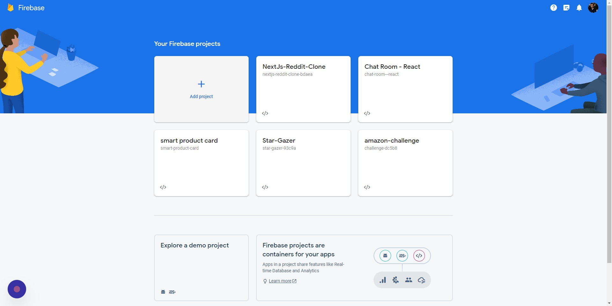
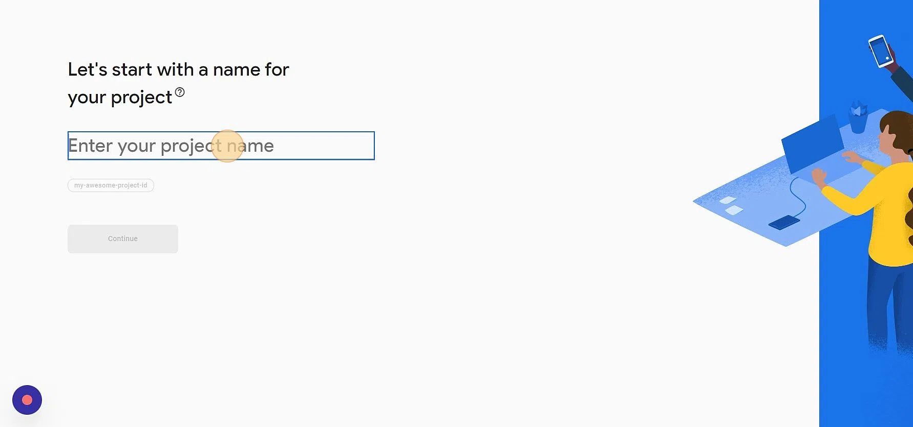
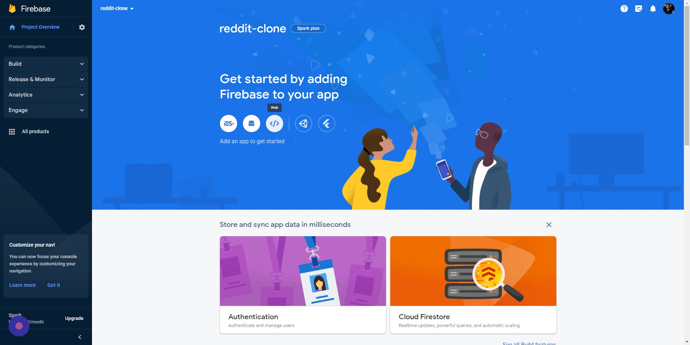
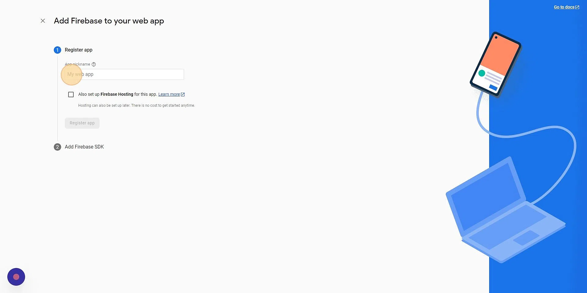
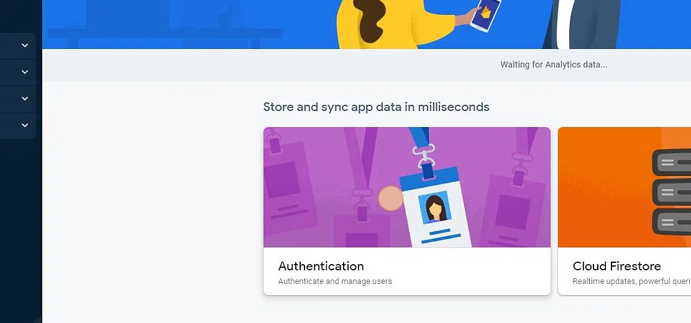
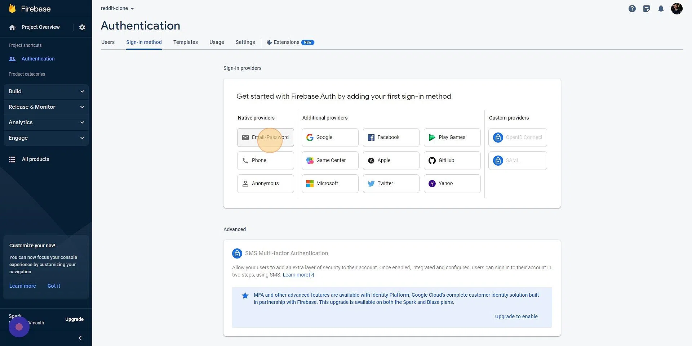
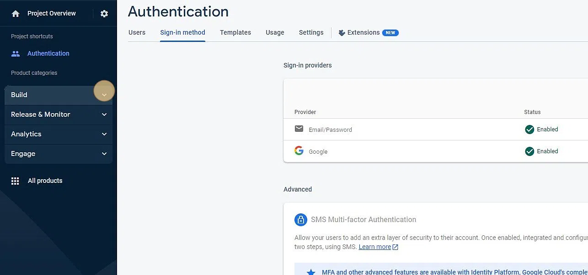
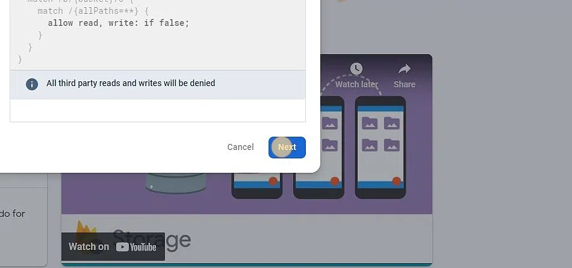
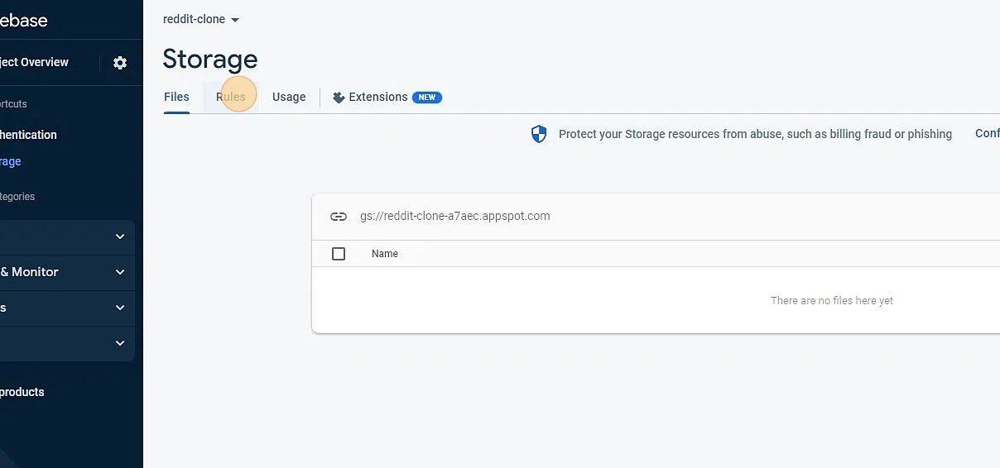

# NextJs-Reddit-Clone

<a href="https://hits.seeyoufarm.com"></a>

A reddit clone made with NextJs 13, Firebase, Chakra UI, Recoil

<p align="center"> 
    </img>
</p>

- **[NextJs](https://nextjs.org/)** (13.x)
- **[React](https://facebook.github.io/react/)** (18.x)
- **[Firebase](https://firebase.google.com/)** (9.x)
- **[Chakra UI](https://chakra-ui.com/)** (2.x)
- **[Recoil](https://recoiljs.org/)** (0.7.x)
- **[Typescript](https://www.typescriptlang.org/)** (4.x)
- Production build script

## Live Demo

See a [live demo](https://next-js-reddit-clone-tasin5541.vercel.app/) on Vercel

## Installation

### Setup Firebase

1. Navigate to `https://console.firebase.google.com/u/0/`<br>
   Click `Add Project`<br>
   

2. Click the `Enter your project name` field.<br>
   Type `reddit-clone`<br>
   Click `Continue`<br>
   Click `Select an account`<br>
   Select your account<br>
   Click `Create project`<br>
   Click `Continue`<br>
   

3. Click `web`<br>
   

4. Click the `App nickname` field.<br>
   Type `your-app-name`<br>
   Click `Register app`<br>
   Copy and store the `firebaseConfig` values<br>
   Click `Continue to console`<br>
   

5. Click `Authentication`<br>
   Click `Get started`<br>
   

6. Click `Email/Password`<br>
   Click `Save`<br>
   Click `Add new provider`<br>
   Click `Google`<br>
   Click `Save`<br>
   

7. Expand `Build` menu<br>
   Click `Storage`<br>
   Click `Get started` <br>
   

8. Click `Next`<br>
   Click `Done`<br>
   

9. Click `Rules` tab<br>
   Copy paste the following in `edit rules`

   ```
   rules_version = '2';
    service cloud.firestore {
      match /databases/{database}/documents {
        match /users/{userId}/{restOfPath=**} {
          allow read, write: if request.auth != null && userId == request.auth.uid;
        }
        match /posts/{postId} {
            allow read;
          allow write: if request.resource.data.creatorId == request.auth.uid;
          allow delete: if request.auth.uid == resource.data.creatorId;
          allow update;
        }
        match /comments/{commentId} {
            allow read;
          allow write: if request.resource.data.creatorId == request.auth.uid;
          allow delete: if request.auth.uid == resource.data.creatorId;
          allow update;
        }
        match /communities/{communityId} {
            allow read;
          allow write: if request.auth != null;
        }
      }
    }
   ```

   Click `Publish`<br>
   

### Setup Project

1. Clone/download repo
2. Create a file called .env in the root directory of your project, type the following in cmd/powershell
   ```
   cp env.example .env
   ```
3. Inside the `.env` file, add the firebase keys from the `firebaseConfig` copied during `step 4` of firebase setup
4. `yarn install` (or `npm install` for npm) to install the dependencies

## Usage

**Development**

`yarn dev`

- Build app continuously (HMR enabled)

**Production**

`yarn build`
`yarn start`

- Build app once (HMR disabled) to `/.next/`

---

**All commands**

| Command      | Description                                |
| ------------ | ------------------------------------------ |
| `yarn dev`   | Build app continuously (HMR enabled)       |
| `yarn build` | Build app once (HMR disabled) to `/.next/` |
| `yarn start` | Run production build                       |

## See also

- Design ideas were taken from [Reddit](https://reddit.com)
- Some Implementation Ideas for this project are taken from [Shadee Merhi](https://youtu.be/zhx9FUSuAsM)
- Project was bootstrapped with [create-next-app](https://nextjs.org/docs/api-reference/create-next-app)
